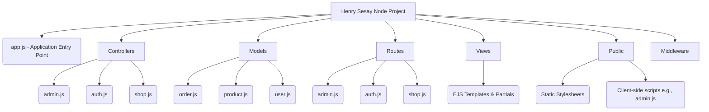
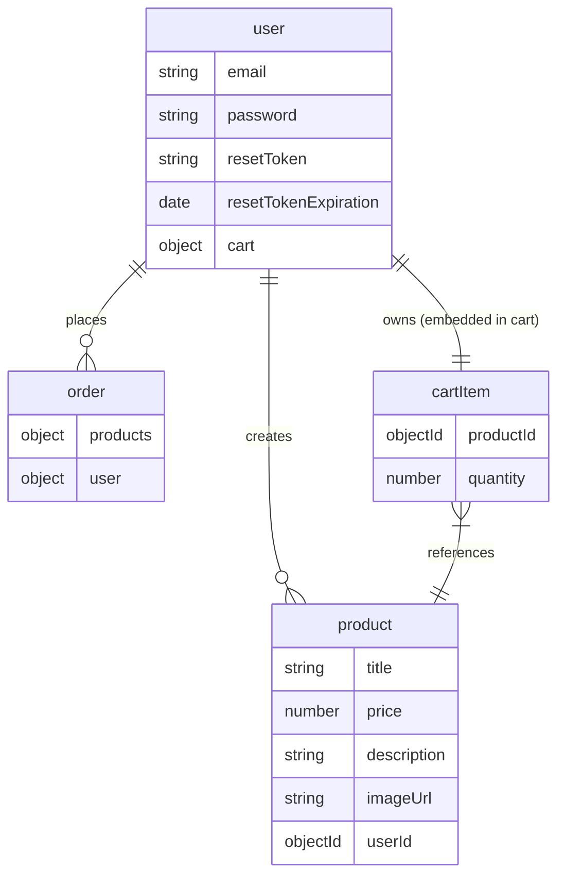

# Henry Sesay Node.js Shop Application

This is a comprehensive Node.js e-commerce application built based on the **"Node.js: The Complete Guide"** structure. This project has evolved from basic MVC concepts into a robust, database-driven application utilizing the Mongoose ODM, Stripe payments, and Multer file uploads.

## ✨ Core Features
* **Modern MVC Architecture:** Clean separation of concerns across Models, Views (EJS), and Controllers.
* **Mongoose ODM:** Robust MongoDB interactions, aggregations, and data validation using the Mongoose library.
* **Authentication & Security:** Fully integrated user authentication (sessions, cookies, bcrypt password hashing), protected routes, and CSRF token defenses.
* **Asynchronous Operations:** Client-side AJAX (Fetch API) combined with server-side JSON handling for seamless, no-reload DOM manipulation (e.g., deleting products).
* **Payment Gateway:** Secure checkout funnel directly integrated with the **Stripe API** for secure session creation and webhooks.
* **File Management:** Dynamic image uploading using `multer` and PDF invoice generation streamed to the client using `pdfkit`.
* **Pagination:** Database-level `limit()` and `skip()` commands to ensure high efficiency for large product datasets.

---

## ⚠️ Critical Security Configuration

Before running this application, you **MUST** provide your own API credentials. All hard-coded credentials have been securely purged from this repository. 

Please locate the following files and insert your exact keys:
1. **MongoDB Connection**
   - File: `app.js` 
   - Search for: `ADD_YOUR_MONGODB_CONNECTION_STRING_HERE`
2. **SendGrid API**
   - File: `controllers/auth.js` 
   - Search for: `ADD_YOUR_SENDGRID_API_KEY_HERE`
3. **Stripe Integration** 
   - File: `controllers/shop.js` 
   - Search for: `ADD_YOUR_STRIPE_SECRET_KEY_HERE`
   - File: `views/shop/checkout.ejs`
   - Search for: `ADD_YOUR_STRIPE_PUBLISHABLE_KEY_HERE`

---

## ⚙️ Installation & Usage

1. **Clone & Install Dependencies**
   Open your terminal in the root directory and install all packages:
   ```bash
   npm install
   ```

2. **Start the Server**
   ```bash
   npm start
   ```

3. **View the Application**
   Open your browser and navigate to the application running locally at: `http://localhost:3000`

---

## 📁 File Structure Diagram

The following architecture demonstrates the modular design of the codebase.



---

## 🗄️ Database ER Diagram (Mongoose)

The backend exclusively utilizes MongoDB and Mongoose. Below is the simplified Entity-Relationship diagram mapping the connections between our primary schemas.


